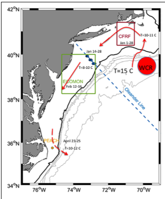
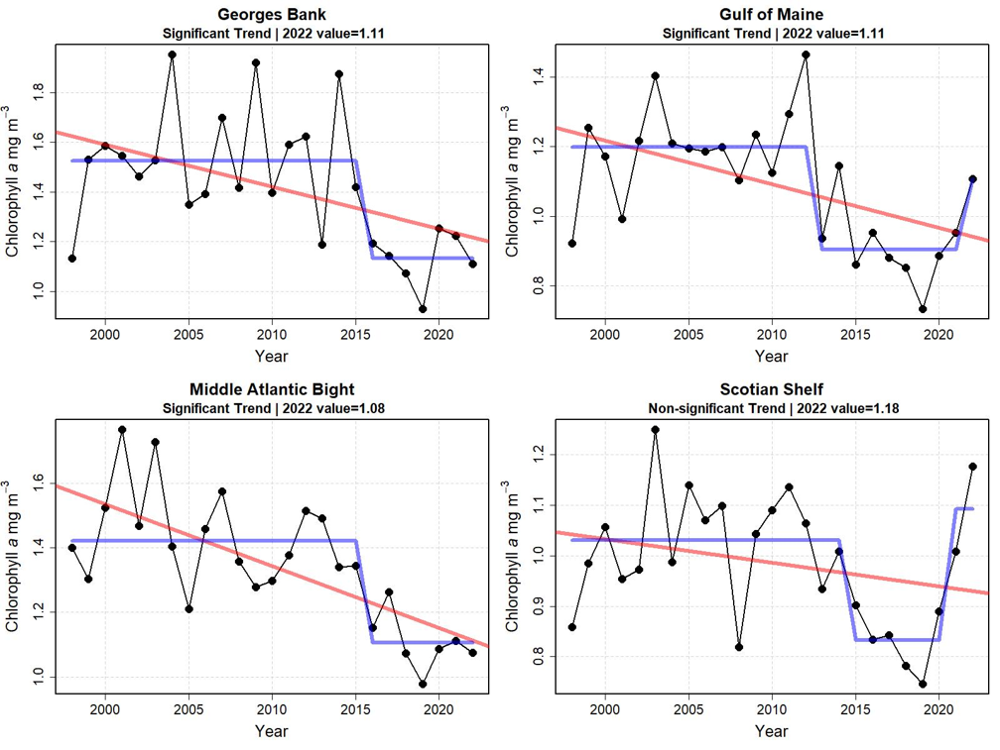

## Comparing shelf conditions in 2023, 2017 and 2012:

     
1.8 Deg C warm anomaly is comparable to the
anomalies in 2012. Six month average anomalies were between 1.6 and 2.6 Deg C.
It is quite possible this anomaly persists until late May or June as it did in 
2012 given the timing of the seasonal cycle- March is the minimum temperature
in the MAB.

